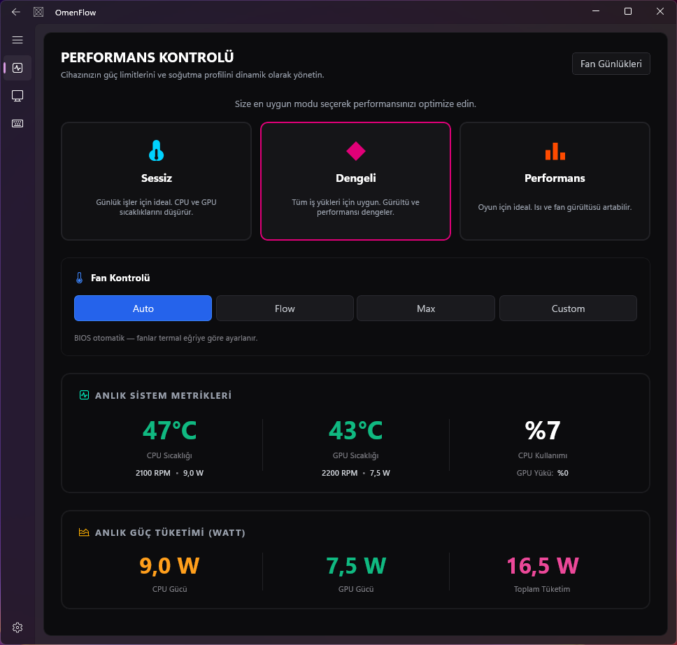
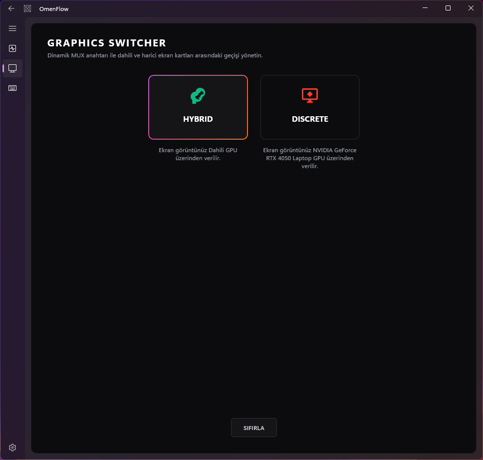
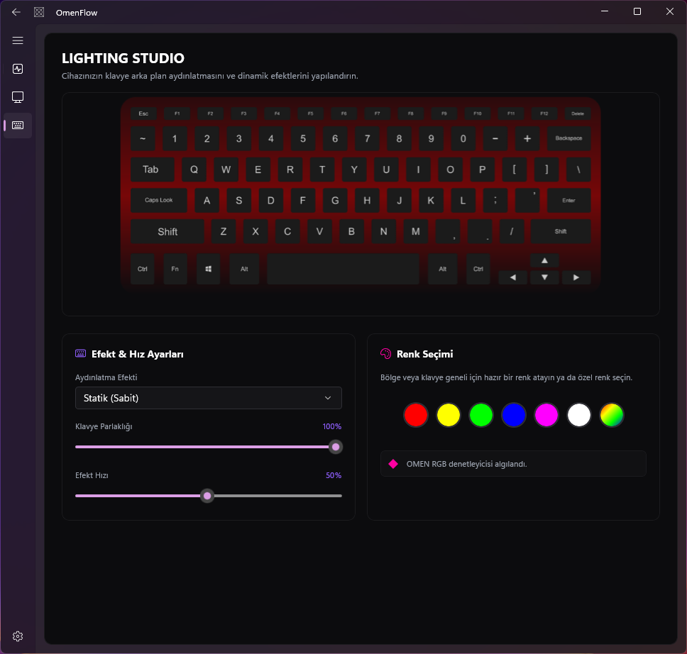
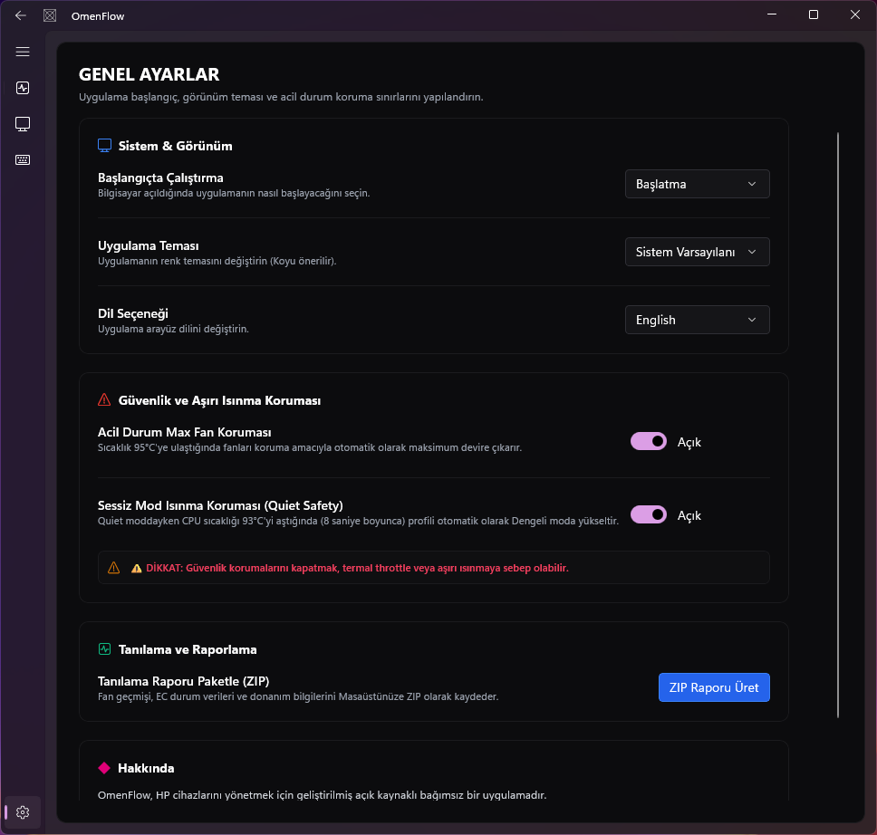

# OmenFlow

**OmenFlow** is a lightweight, modern, and reliable hardware management and lighting control application designed for HP Omen and Victus laptops. It operates directly at the hardware level (via Embedded Controller - EC and WMI BIOS methods).

> [!WARNING]
> **Project Status: Early Development Phase (Work in Progress)**
> This project is fully functional in terms of hardware layer, service architecture, and core features, but it is under active development.

---

## 💻 Supported Models

OmenFlow is designed to work with modern HP gaming laptops. Below is a list of known working series and models:

* **HP Victus 16 (2023/2024)** (e.g., s0xxx series, 8BBE and similar motherboards)
* **HP Victus 15**
* **HP Omen 16 (2022/2023/2024)**
* **HP Omen 17**
* *Other modern HP Omen and Victus models sharing the same WMI and EC architecture.*

---

## 📸 Screenshots

Screenshots of the modern user interface designed with WinUI 3:

### 1. Performance and Fan Control


### 2. GPU MUX Graphics Switcher


### 3. Keyboard Lighting & RGB Effects


### 4. Additional Power and System Settings


---

## 🌐 Communication Architecture

To improve security and stability, OmenFlow separates the user interface (Client Layer) and hardware control (Core Layer) into two different processes:

```
┌────────────────────────────────────────────────────────┐
│               OmenFlow App (WinUI 3 UI)                │
│    (HomePage, PerformancePage, LightingPage, etc.)     │
│                   (Standard Privileges)                │
└──────────┬──────────────────────────────────▲──────────┘
           │                                  │
  [HTTP POST: /api/command]           [HTTP GET: /api/telemetry]
      (JSON Payload)                    (JSON Telemetry)
           │                                  │
           ▼                                  │
┌────────────────────────────────────────────────────────┐
│             OmenFlow.Worker (Background)               │
│         (HTTP Server, SensorReader, Services)          │
│                   (Administrator Privileges)           │
└──────────┬──────────────────────────────────▲──────────┘
           │                                  │
  [WMI 0x20008 / EC 0x62-0x66]        [WMI 0x2D / EC 0xD0-0xD3]
           │                                  │
           ▼                                  │
┌────────────────────────────────────────────────────────┐
│           HP Hardware Layer (BIOS & EC)                │
└────────────────────────────────────────────────────────┘
```

### 1. Client-Server Separation
* **`OmenFlow.App` (Client)**: The WinUI 3 interface seen by the user. Due to Windows security policies, it runs with **standard user privileges**. It does not have direct access to the hardware.
* **`OmenFlow.Worker` (Server)**: A Windows minimal console/service application running in the background. It is executed with **Administrator (Elevated)** privileges to access hardware ports and WMI BIOS classes.

### 2. Local HTTP API Communication
All communication between the client and server takes place over the local loopback on port **`http://localhost:50312`**.
* **Telemetry Pipeline (GET `/api/telemetry`)**: [IpcClient.cs](file:///c:/Users/yeyil/Documents/GitHub/OmenFlow/OmenFlow.App/Helpers/IpcClient.cs) in the interface queries the background service every **2 seconds** to retrieve a single JSON object containing temperatures, RPM values, current power plan, and RGB states.
  * *Adaptive Polling*: If the server is unreachable, the polling interval is gradually increased (5s -> 10s -> 20s -> max 30s) to prevent unnecessary CPU load.
* **Command Pipeline (POST `/api/command`)**: UI actions (setting fan speed, changing colors, etc.) are sent to the server with a JSON body (e.g., `{"Command": "SetBatteryCare", "Value": true}`).

### 3. Automatic Service Triggering
* When the client opens, it checks if the `OmenFlow.Worker` process is running in the OS.
* If the process is not active, the `runas` (run as administrator) verb is called, triggering the Windows UAC prompt, and `OmenFlow.Worker.exe` is started in a hidden background window.

---

## 📊 Data Sources: What do we get and from where?

| Telemetry / Data Type | Primary Source | Secondary / Fallback Source | Processing / Conversion Method |
| :--- | :--- | :--- | :--- |
| **CPU / GPU Temperature** | WMI CMD `0x23` | LHM (`SensorReader`) | The 1-byte data from WMI is read directly as Celsius. |
| **Fan RPM (Speed)**| WMI CMD `0x38` | EC Registers (`0xD0-0xD3`) | If WMI `0x38` is missing, 16-bit data is constructed from EC `0xD0-0xD3` ports: `(HighByte << 8) \| LowByte`. |
| **Fan LUT Step Ratio**| WMI CMD `0x2D` | WMI CMD `0x37` | When true RPM cannot be read on devices like Victus, the 0-55 LUT value is simulated to RPM using the formula `(Step * MaxRPM) / 55`. |
| **CPU / GPU Load & Power** | LibreHardwareMonitor | None | Using [SensorReader.cs](file:///c:/Users/yeyil/Documents/GitHub/OmenFlow/OmenFlow.Worker/SensorReader.cs), the LHM hardware tree is scanned to instantly fetch processor core load and Package Power (W) values. |
| **GPU MUX Mode** | Windows Registry | WMI `Win32_VideoController` | The `InternalMuxState` value in the Registry is read (`2` = Discrete, `1` = Hybrid). Alternatively, the activity of the internal graphics card (iGPU) is checked. |
| **GPU Power Limits** | WMI CMD `0x21` | `nvidia-smi` tool | WMI `0x21` reads `customTgp`, `PPAB`, and Dynamic Boost thermal throttling temperature (`peakTemp`). |
| **Keyboard Lighting** | WMI CMD `0x20009` | WMI CMD `0x20008` (0x2B) | Extracted as 4-Zone RGB color codes from the 128-byte memory space (bytes 25-36) via the color table `0x20009/0x02`. |
| **Battery Care** | WMI CMD `0x24` | None | The battery charge limit mode (80% limit) is queried as a 1-byte flag from the BIOS. |

---

## 🛡️ Security and Background Auxiliary Services

OmenFlow features rich background auxiliary services to prevent instability and protect the hardware:

### 1. Quiet Mode Thermal Protector ([QuietSafetyMonitor.cs](file:///c:/Users/yeyil/Documents/GitHub/OmenFlow/OmenFlow.Hardware/QuietSafetyMonitor.cs))
* **Issue**: In Quiet mode, the BIOS severely throttles the fans and CPU power. Under heavy load (code compilation, video rendering), the CPU temperature can rapidly spike above 95°C.
* **Solution**: The thermal monitoring service continuously tracks CPU temperature while in Quiet mode. If the temperature exceeds the **93.0°C** threshold and remains there continuously for **8 seconds**, the profile is automatically upgraded to **Default (Balanced)** mode.
* **Safety**: When safety is triggered, the profile does not automatically return to quiet mode; the user must do so manually. A **5-minute** cooldown period is enforced between two protection triggers.

### 2. Fan Speed Verification Service ([FanVerificationService.cs](file:///c:/Users/yeyil/Documents/GitHub/OmenFlow/OmenFlow.Hardware/FanVerificationService.cs))
* **Function**: Checks whether fan commands sent to the hardware are physically applied.
* **Mechanism**: **1.8 seconds** after a fan speed or profile is set (or **3.6 seconds** for profile transitions), the hardware fan RPM is read back.
* **Comparison**: The read RPM value is compared against the expected RPM corresponding to the target fan percentage (with a flexible tolerance range of ±35%).
* **Blockage Detection**: If the target speed is >0% but the fans return 0 RPM for **3 consecutive verifications**, a "Stuck Fan/EC Comm Issue" warning is logged.

### 3. Dynamic Calibration Service ([FanCalibrationService.cs](file:///c:/Users/yeyil/Documents/GitHub/OmenFlow/OmenFlow.Hardware/FanCalibrationService.cs))
* **Function**: Matches the characteristic fan speed/RPM behaviors of different HP device families (Omen V1, Omen V2, Victus, Victus S, etc.).
* **Learning Mechanism**: Records the highest instantaneously read RPM values when the device is running at high fan speeds (e.g., 90% and above).
* **Storage**: Learned true max RPM limits and calibration points are stored locally in `C:\ProgramData\OmenFlow\fan_calibration.json`.

### 4. Power Source Automation ([PowerAutomationService.cs](file:///c:/Users/yeyil/Documents/GitHub/OmenFlow/OmenFlow.Hardware/PowerAutomationService.cs))
* **Function**: Automatically manages the power profile when the computer is unplugged or plugged in.
* **Rule Set**: By default, **Performance** is applied when AC (Charger) is connected, and **Quiet** profile when running on Battery. It can be customized from the Settings screen and is saved to `C:\ProgramData\OmenFlow\power_automation.json`.

### 5. Suspend and Resume Management ([SuspendRecoveryService.cs](file:///c:/Users/yeyil/Documents/GitHub/OmenFlow/OmenFlow.Hardware/SuspendRecoveryService.cs))
* **Issue**: Continuing to send fan keep-alive commands while the computer goes into Suspend mode can cause fans to get stuck at high speeds or prevent the device from waking up (standby failure).
* **Suspend**: When a sleep signal is received, the fan curve engine is completely stopped and keep-alive timers are canceled. A snapshot of the active state (fan mode, profile, lighting) is cached in memory.
* **Resume**: When the system wakes up (Resume), it waits for **3 seconds** to allow the BIOS/ACPI layer to stabilize. Then, the last profile, fan curve, and RGB lighting values from before sleep are safely rewritten to the hardware in sequence.

### 6. Diagnostics Export ([DiagnosticsExportService.cs](file:///c:/Users/yeyil/Documents/GitHub/OmenFlow/OmenFlow.Hardware/DiagnosticsExportService.cs))
* **Function**: Bundles all hardware registers and history logs of the system into a single compressed file for bug reporting or investigation.
* **Save Location**: The file is saved to the user's desktop as `OmenFlow_Diagnostics_yyyy-MM-dd_HH-mm-ss.zip`.
* **Package Contents**:
  * `diagnostics.txt`: General system summary, temperatures, RPMs, and active profiles.
  * `fan_command_history.txt`: The time, target value, and success status of the last 80 fan commands.
  * `fan_calibration.txt`: Calibration history and observed max RPM limits.
  * `ec_snapshot.txt`: Instant values of critical Embedded Controller register addresses (`0x95`, `0xCE`, `0x34`, `0x35`, `0xD0-D3`, `0x80`, `0xA0`).
  * `event_log.txt`: The last 500 lines of the transaction log.

---

## ⚙️ WMI & EC Command Reference (Detailed Catalog)

Below are the sub-commands that manage hardware communication on the OmenFlow side, along with their parametric structures.

### 1. Hardware Control Commands (WMI Category: `0x20008`)

All requests are sent to the `hpqBIntM` method of the `hpqBDataIn` class under `root\WMI`. Input object properties: `Sign` (always `[0x53, 0x45, 0x43, 0x55]`), `Command` (`0x20008`), `CommandType` (Sub-CMD values below), `hpqBData` (Input payload), and `Size` (Input payload size).

#### 🔴 `0x10` (Heartbeat / Wake-Up)
* **Payload**: `[0x00, 0x00, 0x00, 0x00]` (4-byte zero)
* **OutSize**: 4 Bytes
* **Task**: Pokes the BIOS to start listening to the WMI port while it's sleeping. It's also sent every 5 seconds while the fan is under manual control to prevent the BIOS from forcibly overriding the automatic fan control.

#### 🔴 `0x1A` (Thermal Policy Switch)
* **Payload**: `[0xFF, ModeByte, 0x00, 0x00]`
* **OutSize**: 0 Bytes
* **Task**: Changes hardware power limits (TDP) and fan thresholds at the BIOS level.
  * `ModeByte = 0x30` (48) -> Default (Balanced)
  * `ModeByte = 0x31` (49) -> Performance (High Power Limits)
  * `ModeByte = 0x50` (80) -> Quiet (Low TDP limits)

#### 🔴 `0x21` (Get GPU Power State)
* **Payload**: `[0x00, 0x00, 0x00, 0x00]` (4-byte)
* **OutSize**: 4 Bytes
* **Task**: Reads the GPU Dynamic Boost and TGP status.
  * The returned buffer's `data[0]` value is `customTgp` (0 or 1), `data[1]` is `PPAB` (0 or 1), and `data[3]` is the graphics card thermal throttling threshold temperature (`peakTemp`).

#### 🔴 `0x22` (Set GPU Power State)
* **Payload**: `[CustomTgp, Ppab, 0x01, PeakTemp]`
* **OutSize**: 0 Bytes
* **Task**: Manages NVIDIA Dynamic Boost TGP extra limits.
  * Send `CustomTgp=0, Ppab=0` for Base Power, `CustomTgp=1, Ppab=0` for Extra Power, and `CustomTgp=1, Ppab=1` for Max Power (maximum boost). When writing `PeakTemp`, the original value read with `0x21` must be preserved and forwarded exactly (never zero) for hardware protection.

#### 🔴 `0x23` (Get Temperature Sensors)
* **Payload**: `[SensorID, 0x00, 0x00, 0x00]`
* **OutSize**: 4 Bytes
* **Task**: Reads the physical temperature sensors on the motherboard.
  * `SensorID = 0x01` -> CPU Temperature. Output is in `OutData[0]`.
  * `SensorID = 0x02` -> GPU Temperature. Output is in `OutData[0]`.

#### 🔴 `0x24` (Battery Care Mode)
* **Payload**: `[ModeByte, 0x00, 0x00, 0x00]`
* **OutSize**: 4 Bytes (When reading) / 0 Bytes (When writing)
* **Task**: Toggles the battery's 80% charge limit protection.
  * `ModeByte = 0x01` -> Cuts off charge at 80% to preserve battery life.
  * `ModeByte = 0x00` -> Charges the battery up to 100%.

#### 🔴 `0x27` (Set Max Fan Command)
* **Payload**: `[EnabledByte, 0x00, 0x00, 0x00]`
* **OutSize**: 0 Bytes
* **Task**: Locks the fans to maximum speed.
  * `EnabledByte = 0x01` -> Fans are locked to 100% duty cycle.
  * `EnabledByte = 0x00` -> Lock is released and fan control is handed back to WMI profile rules.

#### 🔴 `0x29` (Set CPU Power Limits)
* **Payload**: `[PL1_Watt, PL2_Watt, 0x00, 0x00]`
* **OutSize**: 0 Bytes
* **Task**: Directly sets the processor's sustained power limit (PL1) and short-term turbo power limit (PL2) in Watts (e.g., `[45, 90, 0, 0]` for 45W / 90W limits).

#### 🔴 `0x2B` (Get Keyboard Feature Type)
* **Payload**: `[0x00, 0x00, 0x00, 0x00]`
* **OutSize**: 4 Bytes
* **Task**: Queries the physical keyboard backlight capability on the device.
  * If the return value `OutData[0] == 0x04` it's a 4-Zone RGB keyboard, if `0x05` it's Per-Key RGB, other values define Standard 1-Zone lighting.

#### 🔴 `0x2D` / `0x37` (Get Fan Level LUT V1 / V2)
* **Payload**: `[0x00, 0x00, 0x00, 0x00]`
* **OutSize**: 128 Bytes
* **Task**: Returns the instant operating step index determined by the BIOS for the fans. It's in the 0-55 range for V1/Victus models, and 0-100 range for V2 models.
  * `OutData[0]` = CPU fan level, `OutData[1]` = GPU fan level.

#### 🔴 `0x2E` (Set Fan Level LUT)
* **Payload**: `[CpuLevel, GpuLevel, 0x00, 0x00]`
* **OutSize**: 0 Bytes
* **Task**: Manually sets the fan speed. On Victus/V1 devices, the `CpuLevel` and `GpuLevel` parameters are capped at a maximum of **55**.

#### 🔴 `0x38` (Get Fan RPM - V2)
* **Payload**: `[0x00, 0x00, 0x00, 0x00]`
* **OutSize**: 128 Bytes
* **Task**: On newer generation (Omen V2) devices, this reads the instantaneous true rotational speeds (RPM) of the fans directly from the BIOS tachometer without millisecond delay.
  * CPU RPM: `OutData[0] \| (OutData[1] << 8)`
  * GPU RPM: `OutData[2] \| (OutData[3] << 8)`

---

### 2. Lighting Control Commands (WMI Category: `0x20009`)

#### 🔵 `0x02` (Get RGB Lighting Table)
* **Payload**: `[0x00, 0x00, ... 0x00]` (128 bytes)
* **OutSize**: 128 Bytes
* **Task**: Reads the current state of the 4-Zone RGB color table. Color codes are in the 12-byte memory space between indices `25` and `36` of the output.

#### 🔵 `0x03` (Set RGB Lighting Table)
* **Payload**: `[0x03, 0x00, ... [Zones] ...]` (128 bytes)
* **OutSize**: 0 Bytes
* **Task**: Sends a color packet to the 4-Zone RGB keyboard.
  * The first byte must be `0x03`. Zone colors start from the 25th byte:
    * Zone 1 (R, G, B) -> `payload[25], payload[26], payload[27]`
    * Zone 2 (R, G, B) -> `payload[28], payload[29], payload[30]`
    * Zone 3 (R, G, B) -> `payload[31], payload[32], payload[33]`
    * Zone 4 (R, G, B) -> `payload[34], payload[35], payload[36]`

#### 🔵 `0x04` / `0x05` (Get/Set Standard Backlight)
* **Task**: Turns the light of single-color backlit keyboards on or off.
  * In the `0x04` query, the return value `0xE4` means on, `0x64` means off.
  * In the `0x05` write command, the payload is sent as `[0xE4, 0x00, 0x00, 0x00]` (On) or `[0x64, 0x00, 0x00, 0x00]` (Off).

---

### 3. Graphics Card MUX Switch Commands (WMI Category: `0x00002` / `0x00001` Fallback)

#### 🟢 `0x52` (MUX Switch Mode)
* **Payload**: `[ModeByte, 0x00, 0x00, 0x00]`
* **OutSize**: 4 Bytes (When reading) / 0 Bytes (When writing)
* **Task**: Changes the graphics card MUX switch.
  * `ModeByte = 0x01` -> Discrete GPU Only (Discrete Mode - Intel/AMD graphics card is disabled, maximum gaming performance).
  * `ModeByte = 0x00` -> Hybrid / Optimus (Hybrid Mode - Energy saving).
  * *After the MUX change is dispatched, WMI requests are suspended, and the hardware is safeguarded until the computer restarts.*

---

### 4. Embedded Controller (EC) Register Command Catalog

OmenFlow provides fallback by writing low-level direct hardware commands to Embedded Controller (EC) registers. EC ports `0x62` (Data) and `0x66` (Command) are controlled via the PawnIO interface.

* **`0x34` (CPU Fan Override Level)**: Writes the CPU fan speed ratio (as LUT level) directly to the EC.
* **`0x35` (GPU Fan Override Level)**: Writes the GPU fan speed ratio (as LUT level) directly to the EC.
* **`0x95` (Hardware Profile Target)**: This is the hardware equivalent of the WMI 0x1A command. `0x01` represents Performance, `0x02` Quiet, `0x00` Default (Balanced) mode.
* **`0xCE` (Fan Profile Transition Trigger)**: On Victus S series, provides a transition trigger to prevent the BIOS from suddenly stopping the fans during fan step transitions (`0x00` = Quiet, `0x01` = Default, `0x02` = Performance).
* **`0xD0-0xD1` (CPU Fan Tachometer Lo/Hi)**: Reads the instantaneous rotational speed (RPM) of the CPU fan.
* **`0xD2-0xD3` (GPU Fan Tachometer Lo/Hi)**: Reads the instantaneous rotational speed (RPM) of the GPU fan.

---

## 📂 Directory Structure and File Roles

The project files are logically divided into 5 main sections:

```
OmenFlow/
│
├── OmenFlow.Core/                               # Shared model files and interface contracts
│   ├── Models/                                  # Telemetry, fan curves, and power plan DTOs
│   ├── Interfaces/                              # Hardware service abstractions
│   └── Services/                                # Logger.cs (Central logging)
│
├── OmenFlow.Hardware/                           # Hardware access services and WMI/EC controllers
│   ├── BiosService.cs                           # WMI queue loop and heartbeat service
│   ├── EcService.cs                             # Hardware register read/write with PawnIO
│   ├── ModelCapabilityDatabase.cs               # Victus (55 LUT) / Omen (100 LUT) model boundaries database
│   ├── FanControlService.cs                     # Fan modes and auto/manual fan control
│   ├── FanCurveHostedService.cs                 # Background thread applying custom fan curves
│   ├── QuietSafetyMonitor.cs                    # Quiet mode overheating protection
│   ├── SuspendRecoveryService.cs                # Post-resume state restorer
│   ├── DiagnosticsExportService.cs              # Service generating diagnostic ZIP packages to desktop
│   ├── FanCalibrationService.cs                 # Model-based RPM calibration manager
│   └── FanVerificationService.cs                # RPM speed verification and stuck fan check
│
├── OmenFlow.Worker/                             # Administrator privileged background server
│   ├── Program.cs                               # Minimal HTTP API (localhost:50312) and routing
│   ├── SensorReader.cs                          # CPU/GPU load, power, and RAM tracking with LHM
│   └── WmiBiosMonitor.cs                        # Periodic worker refreshing telemetry in the background
│
├── OmenFlow.App/                                # WinUI 3 based user interface (Client)
│   ├── Pages/                                   # UI pages (Performance, Lighting, MUX etc.)
│   └── Helpers/IpcClient.cs                     # Client class communicating with the HTTP server
│
├── OmenFlow.TestConsole/                        # Interactive WMI/EC terminal for developers
└── README.md                                    # Main documentation file
```

---

## 🤝 Acknowledgments and Contributors

OmenFlow is built upon reverse engineering efforts on HP hardware layers and open-source research. We thank the following projects for the infrastructure they provided and the valuable information they shared:
* **[omencore](https://github.com/theantipopau/omencore)**: A unique reverse engineering project that pioneered the decoding of HP WMI and EC layers and enabled the understanding of WMI protocols.
* **[OmenMon-Reborn](https://github.com/seakyy/OmenMon-Reborn)**: A successful endeavor offering practical solutions regarding EC fan control limits, memory overflows (55 LUT restriction), and stable fan curves.

---

## 📄 License

This project was developed to be shared with the open-source community. You can check the `LICENSE` file for details.
